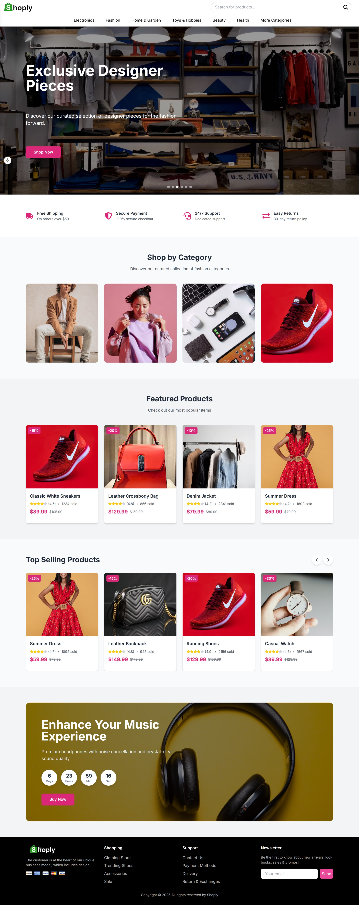

# 🛍️ E-Commerce Frontend – Next.js + Tailwind CSS

A modern, responsive e-commerce frontend built using **Next.js (App Router)** and **Tailwind CSS**.

---

## ⚙️ Tech Stack

* **Framework**: Next.js 14 (App Router)
* **Styling**: Tailwind CSS
* **Forms**: React Hook Form
* **UI**: React Icons, React Toastify
* **State**: Context API & custom hooks

---

## ✨ Features

* ✅ Product listing & filtering
* ✅ Product detail pages
* ✅ Shopping cart with quantity updates
* ✅ User authentication pages (Login, Register, Profile)
* ✅ Fully responsive design
* ✅ Clean, modular code with reusable components

---

## 🖼️ Screenshots
### Homepage
> 
---

## 🚀 Getting Started

```bash
cd frontend
npm install
npm run dev
```

---

## 📜 License

MIT License
